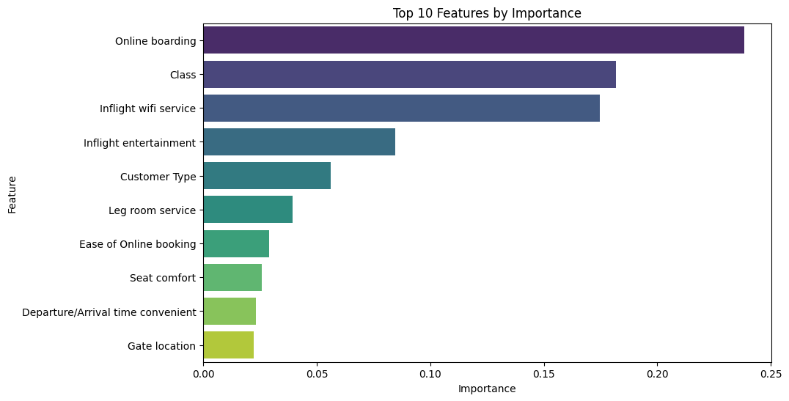

# Airline Passenger Satisfaction Classifier 

##  Project Overview
In the highly competitive airline industry, customer experience is the primary differentiator. This project implements a Machine Learning pipeline to predict passenger satisfaction levels and identify the specific service factors (e.g., In-flight Wi-Fi, Boarding) that drive positive experiences.

**[View the Jupyter Notebook](./ML_pipeline.ipynb)
##  Key Results
| Metric | Score | Notes |
|--------|-------|-------|
| **Test Accuracy** | **96%** | High generalization capability on unseen data |
| Training Accuracy | 97.9% | Slight overfitting addressed via hyperparameter tuning |
| Key Driver | **Online Boarding** | Strongest correlation with satisfaction |

##  Business Insights
Based on Feature Importance analysis, the model identified the following areas as critical for ROI:
1.  **Online Boarding:** Streamlining the app/web check-in process yields the highest satisfaction boost.
2.  **In-flight Wi-Fi:** A major pain point; upgrading connectivity is a priority recommendation.
3.  **Entertainment:** Key factor for long-haul flight retention.

##  Tech Stack
- **Language:** Python
- **Libraries:** Scikit-learn, Pandas, NumPy, Matplotlib, Seaborn.
- **Models:** Random Forest Classifier (optimized via GridSearch).

##  Methodology
1.  **Data Cleaning:** Handling missing values and encoding categorical service variables.
2.  **EDA:** Visualizing distribution of satisfaction across customer classes.
3.  **Modeling:** Training tree-based ensemble methods to capture non-linear relationships.
4.  **Optimization:** Addressed overfitting by tuning max_depth and n_estimators.

##  Future Work
- Implement XGBoost to potentially improve accuracy by another 1-2%.
- Deploy as a web app using Streamlit to allow stakeholders to simulate changes in service levels.
